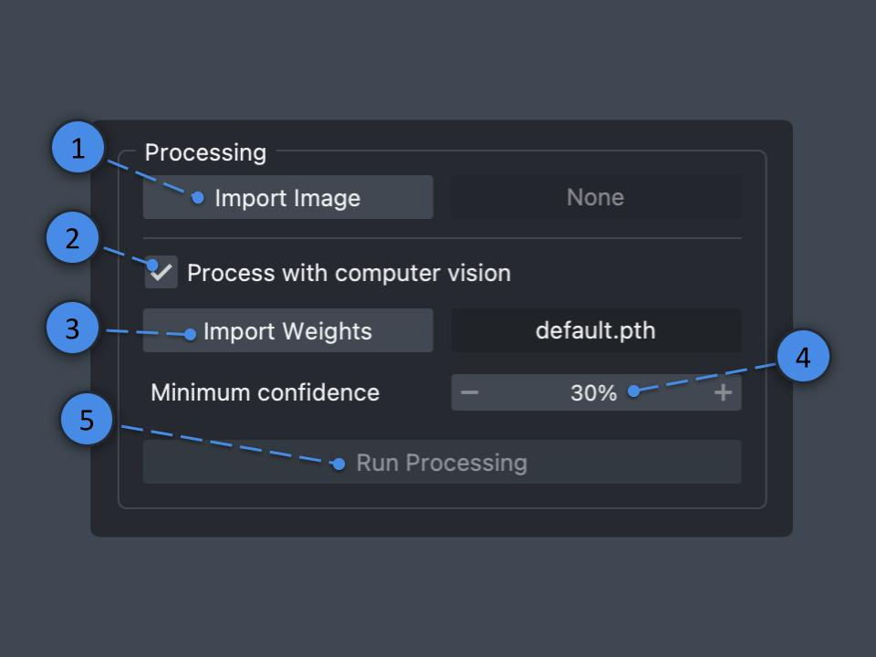

# AlveolEye: Automated Lung Morphometry Made Easy

[](https://www.napari-hub.org/plugins/AlveolEye)
[](https://pypi.org/project/AlveolEye/)


[](https://pypi.org/project/AlveolEye/)


This repository contains the beta version of AlveolEye, created by the [Sucre lab](https://www.sucrelab.org/).  
Code authored by Samuel Hirsh, Joseph Hirsh, Nick Negretti, and Shawyon Shirazi.

AlveolEye is a Napari plugin that uses computer vision tools and classical image processing  
to calculate mean linear intercept (MLI) and airspace volume density (ASVD) from histological images.

The primary goal of this tool is to aid researchers, not to provide a complete automated annotation solution.

We welcome issues, feedback, and pull requests!

## Installation

The goal of this process is to create a conda environment containing both Napari and all AlveolEye requirements.

*If you already have conda set up, you can skip step 1.*

1. **Install Miniconda** by downloading the appropriate version from [here](https://docs.anaconda.com/free/miniconda/):  
   - Choose the version that matches your processor.  
   - Download the `.pkg` version for easy installation.

2. **Clone the repository** by opening a terminal or Miniconda prompt and running:
   ```
   git clone https://github.com/SucreLab/AlveolEye
   ```

3. **Navigate to the directory**:
   ```
   cd AlveolEye
   ```

4. **Create the conda environment**:
   ```
   conda env create -f ./environment.yml
   ```

5. **Activate the environment**:
   ```
   conda activate AlveolEye
   ```

6. **Install the plugin**:
   ```
   pip install .
   ```

7. **Launch Napari** and locate the plugin in the plugin menu:
   ```
   napari
   ```

## Running Post-Installation

1. Open a terminal or Miniconda prompt, activate the environment, and run Napari:
```
conda activate AlveolEye
napari
```

<div align="right">
  <a href="#alveoleye-automated-lung-morphometry-made-easy">Back to Top</a>
</div>

## Usage

### Processing: Identify and Segment Vessel and Airway Epithelium with Computer Vision



1. **Select an image**  
   - Click the "Import Image" button.  
   - Use the file dialog to select an image (`.jpg`, `.png`, or `.tiff`).  
   - Verify the image is correctly loaded in the "Image" layer and check the file name displayed.

2. **Toggle computer vision processing**  
   - Keep the checkbox selected to process the image with AI (continue to step 3).  
   - Unselect to skip AI processing (skip to step 5).

3. **Select a model**  
   - For the default model, proceed to step 4.  
   - To use a custom model:  
     - Click the "Import Weights" button.  
     - Select a model file (`.pth`).  
     - Verify the model name is displayed correctly.

4. **Set confidence level**  
   - Adjust the percentage using the input box or "-/+" buttons.  
   - Predictions with lower confidence than this threshold will not appear.

5. **Run processing**  
   - Click the "Run Processing" button.  
   - Once completed, manually edit the prediction as needed using Napari's built-in tools.

<div align="right">
  <a href="#alveoleye-automated-lung-morphometry-made-easy">Back to Top</a>
</div>

### Postprocessing: Segment Alveolar Tissue, Find Lumens, and Prepare Image for Assessment

1. **Configure thresholding**  
   - For manual thresholding: Check the box and set the threshold level.  
   - For automatic thresholding (Otsu's method): Leave the box unchecked.

2. **Remove small particles**  
   - Set the maximum size cutoff for particles to remove.  
   - Particles with fewer pixels than this value will be removed.

3. **Remove small holes**  
   - Set the maximum size cutoff for holes to remove.  
   - Holes with fewer pixels than this value will be removed.

4. **Run postprocessing**  
   - Click the "Run Postprocessing" button.  
   - Manually edit the results if necessary using Napari's tools.

<div align="right">
  <a href="#alveoleye-automated-lung-morphometry-made-easy">Back to Top</a>
</div>

### Assessments: Calculate Morphometry Measurements

1. **Configure assessments**  
   - **ASVD**: Select the checkbox to include Airspace Volume Density calculations.  
   - **MLI**: Select the checkbox to include Mean Linear Intercept calculations.  
   - Uncheck either option to exclude data from export or increase processing speed.

2. **Configure MLI parameters**  
   - **Number of lines**: Set the number of MLI lines.  
   - **Minimum length**: Set the minimum chord length for inclusion in calculations.  
   - **Scale**: Set the pixel-to-physical space multiplier.

3. **Run assessments**  
   - Click the "Run Assessments" button.  
   - View results displayed beside assessment checkboxes.

<div align="right">
  <a href="#alveoleye-automated-lung-morphometry-made-easy">Back to Top</a>
</div>

### Export Results

**Results Explanation**

- **MLI**: Mean Linear Intercept for the tissue image  
- **Standard deviation**: Standard deviation of chord lengths used in MLI calculation  
- **Number of chords**: Number of chords used in MLI calculation  
- **ASVD**: Airspace Volume Density for the image  
- **Airspace pixels**: Total number of airspace pixels  
- **Non-airspace pixels**: Total number of non-airspace pixels

**Export Process**

1. **Add results**: Click "Add" to include current assessment data in the export file.  
2. **Remove results**: Click "Remove" to delete the last added results.  
3. **Clear data**: Click "Clear" to empty the export data file.  
4. **Export**: Click "Export Results" to save the data (`.csv` or `.json` format).

<div align="right">
  <a href="#alveoleye-automated-lung-morphometry-made-easy">Back to Top</a>
</div>

## Manual Annotation Guide

### Label Reference

| Structure           | Label Number |
|--------------------|--------------|
| Blocker            | 1            |
| Airway Epithelium  | 2            |
| Vessel Endothelium | 3            |
| Airway Lumen       | 4            |
| Vessel Lumen       | 5            |
| Parenchyma         | 6            |
| Alveoli            | 7            |

### Annotation Tips

- **Eyedropper tool**: Click the eyedropper tool, then click a pixel in the image to set its label as your active label for drawing and editing.  
- **Layer selection**: Ensure you're working on the correct layer before annotating.  
- **Visibility control**: Hide unnecessary layers using the eye icon for clearer viewing.

<div align="right">
  <a href="#alveoleye-automated-lung-morphometry-made-easy">Back to Top</a>
</div>

## Additional Information

### Theme Settings

Change the application appearance using:

- **Windows/Linux**: `Ctrl + Shift + T`  
- **macOS**: `Cmd + Shift + T`

Or through Napari preferences:

1. Select "napari" in the menu bar.  
2. Choose "Preferences".  
3. Click "Appearance" in the left menu.  
4. Select "dark," "light," or "system" in the theme dropdown.

<div align="right">
  <a href="#alveoleye-automated-lung-morphometry-made-easy">Back to Top</a>
</div>
